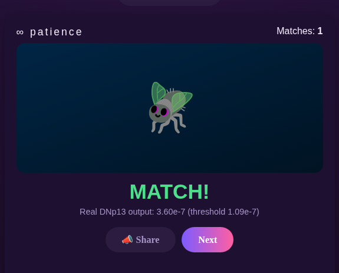

# FlyRizz



A courtship "speed dating" game judged by a real Drosophila connectome (`male-cns:v1.0`, ~176k
real neurons). Pick a role, mint a fly, swipe on dates -- each real outcome is decided by real
`pC1`/`aSP` courtship-decision neurons driving real `DNp13`/`DNa01` descending outputs, not a
scripted RNG. See [`backend/README.md`](backend/README.md) for the full neuron-by-neuron rationale.

## Requirements

Fully standalone -- `connectome.py` is vendored into `backend/src/fly_speed_dating_backend/`
(copied from the sibling `fly_simulation` project, not a path dependency), so this repo deploys
on its own.

### Connectome cache

The full real connectome is ~176k neurons / 25.7M synaptic edges and takes ~400MB of RAM just to
load -- too much for a free hosting tier (e.g. Render's 512MB limit OOMs almost immediately). This
game only ever touches the real courtship pathway (`DA1`/`DA2` -> `pC1`/`aSP` -> `DNa01`/`DNp13`),
so what ships committed in-repo at `backend/.cache/` is a *pruned* subgraph -- same real edges and
weights, just restricted to the ~8.6k neurons reachable around that pathway (~3.5MB, ~165MB RAM to
load). See `backend/scripts/build_pruned_cache.py` for exactly how it's derived and why naive
graph pruning doesn't work on this small-world connectome.

If the courtship pathway constants in `connectome.py` ever change, regenerate it:
```bash
cd backend
# needs the full connectome cache locally first (NEUPRINT_TOKEN required for a from-scratch fetch)
uv run python -c "from fly_speed_dating_backend.connectome import load_or_build_connectome as l; l(cache_dir='.cache', scope='full', token='...')"
uv run python scripts/build_pruned_cache.py
```

## Setup

```bash
cp .env.example .env   # fill in Supabase keys; NEUPRINT_TOKEN only needed to regenerate the cache
cd backend && uv sync
```

The frontend is a single static `frontend/index.html` -- no build step, no dependencies.

## Running it

```bash
# Terminal 1
cd backend && uv run python -m fly_speed_dating_backend.server

# Terminal 2
cd frontend && python3 -m http.server 8899
```

Then open `http://localhost:8899/index.html`.

## Database

Leaderboard and match history are stored in Supabase (`leaderboard`, `match_log` tables, RLS
enabled with public read-only policies -- writes go through the backend's service key only). See
`backend/src/fly_speed_dating_backend/leaderboard.py`.

## Deploying (Render)

**Backend** -- Render Web Service:
- Root Directory: `backend`
- Build Command: `pip install uv && uv sync --frozen`
- Start Command: `uv run python -m fly_speed_dating_backend.server`
- Environment variables: `SUPABASE_URL`, `SUPABASE_SECRET_KEY` (the server never reads
  `NEUPRINT_TOKEN`/`NEUPRINT_HOST` -- those only matter for the local cache-regeneration command
  above). Render sets `PORT` itself -- the server reads it automatically and binds `0.0.0.0`, which
  is required for Render's router to reach it.

**Frontend** -- any static host (Render Static Site, Netlify, GitHub Pages, ...) serving
`frontend/index.html` as-is. Before deploying, edit the `WS_URL` fallback near the top of that
file's `<script>` to your backend's real `wss://<service>.onrender.com` URL (it auto-detects
`localhost` for local dev, so this only affects the deployed build).

**Cold starts**: Render's free tier spins a service down after inactivity and takes up to ~a
minute to wake back up on the next request. The frontend already retries its WebSocket connection
every 2s and queues whatever the player does in the meantime (role/name choices apply instantly,
no server needed for those) -- a full-screen "waking up the fly brain" overlay only blocks once
they reach an action that needs a real server response (starting to mint), and auto-continues the
moment it connects.

---

[github.com/rferrari/flyrizz](https://github.com/rferrari/flyrizz)
